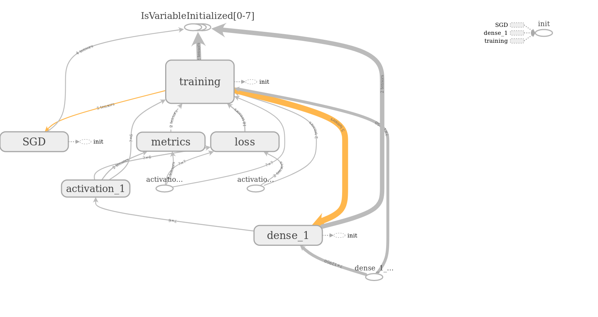
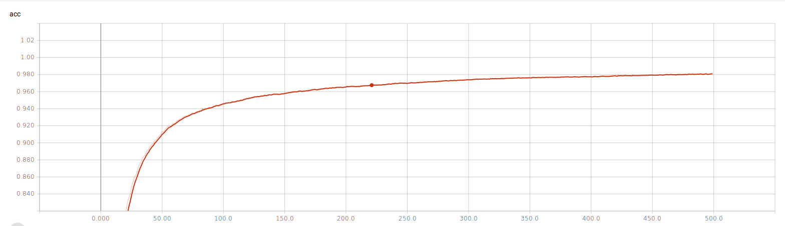
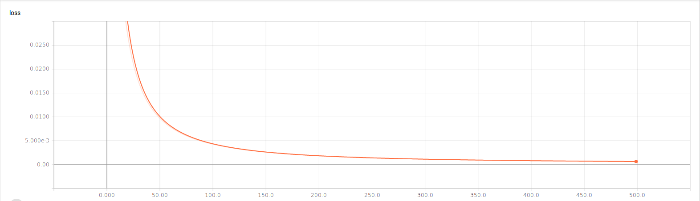

# Semantic Text Similarity using Neural Networks and TF-IDF #

Proof of Concept attemp at [Semantic Text Similarity](http://ixa2.si.ehu.eus/stswiki/index.php/Main_Page) with TF-IDF and ML.

## Objective ##
Investigate whether Semantic Text Similarity (STS) task can be approached using a TF-IDF based encoding for a Neural Network.

## Data processing pipeline ##
The data pipeline for this task is built as follows:
- read and concatenate the texts to be processed
- encode the texts into a real-valued matrix based on TF-IDF where each row represents a single text
- feed the encoded texts to a dense neural network which will classify each pair into one of 6 categories of similarity

## Repository setup ##
The repository is setup as follows:
- `img` folder contains images included in this file
- `src` folder contains the code for current PoC
- `data` folder contains the data used for this PoC:
  - `sts-dev.csv` -- the data set used for developing the model
  - `sts-train.csv` -- the data set used for training the model
  - `sts-test.csv` -- the data set used for evaluating the model

## Model and training ##

### Model ###

As mentioned above, the model is a simple dense layer with a `tanh` activation above it.

``` text
_________________________________________________________________
Layer (type)                 Output Shape              Param #
=================================================================
dense_1 (Dense)              (None, 6)                 77706
_________________________________________________________________
activation_1 (Activation)    (None, 6)                 0
=================================================================
Total params: 77,706
Trainable params: 77,706
Non-trainable params: 0
_________________________________________________________________

```


### Training ###
- **optimizer**: `stochastic gradient descent`
- **number of epochs**: `500`
- **loss function**: `mean squared error`
- **metrics**: `mean absolute error`, `categorical accuracy`

#### Accuracy ####


#### Loss ####


## Evaluation ##
The first evaluation attemp failed due to an error:

``` python
ValueError: Error when checking input: expected dense_1_input to have shape (12950,) but got array with shape (7572,)
```

This signals the main **issues** of this approach:
- **The model is too rigid and cannot accomodate new words**
- **Faulty encoding** - the _encoding is tightly coupled with text corpus_; in the training phase, since training corpus is larger than test corpus, using `TF-IDF` as the encoding mechanism for texts resulted in each text being represented in a `6475` dimensional vector (`12950/2`) while encoding the test set resulted in a `3786` dimensional vector which cannot be accepted by the model because the model is expecting to work with vectors of the same dimensionality as those it was trained on.
