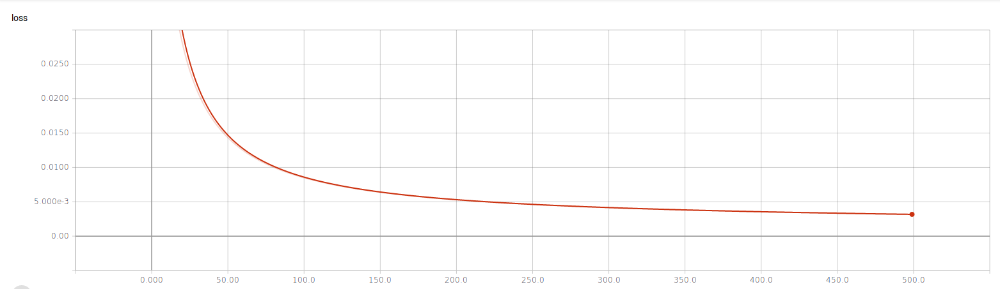

# Semantic Text Similarity using Neural Networks and TF-IDF #

Proof of Concept attemp at [Semantic Text Similarity](http://ixa2.si.ehu.eus/stswiki/index.php/Main_Page) with TF-IDF and ML.

## Objective ##
Investigate whether Semantic Text Similarity (STS) task can be approached using a TF-IDF based encoding for a Neural Network.

## Data processing pipeline ##
The data pipeline for this task is built as follows:
- read and concatenate the texts to be processed
- encode the texts into a real-valued matrix based on TF-IDF where each row represents a single text
- feed the encoded texts to a dense neural network which will classify each pair into one of 6 categories of similarity

## Repository setup ##
The repository is setup as follows:
- `img` folder contains images included in this file
- `src` folder contains the code for current PoC
  - `model.py` contains the code where train and test data sets are separate
  - `fulltextmodel.py` contains the code where train and test texts are concatenated to build a single TF-IDF encoding
- `data` folder contains the data used for this PoC:
  - `sts-dev.csv` -- the data set used for developing the model
  - `sts-train.csv` -- the data set used for training the model
  - `sts-test.csv` -- the data set used for evaluating the model

## Running the code ##

``` shell
cd ./src/
python model.py
```
or

``` shell
cd ./src/
python fulltextmodel.py
```

## Model and training ##

### Model ###

As mentioned above, the model is a simple dense layer with a `linear` activation above it.

``` text
_________________________________________________________________
Layer (type)                 Output Shape              Param #
=================================================================
dense_1 (Dense)              (None, 6)                 145278
_________________________________________________________________
activation_1 (Activation)    (None, 6)                 0
=================================================================
Total params: 145,278
Trainable params: 145,278
Non-trainable params: 0
_________________________________________________________________

```


### Training ###
- **optimizer**: `stochastic gradient descent`
- **number of epochs**: `500`
- **loss function**: `mean squared error`
- **metrics**: `mean absolute error`, `categorical accuracy`

#### Accuracy ####


#### Loss ####


## Evaluation ##
The first evaluation attemp failed due to an error:

``` python
ValueError: Error when checking input: expected dense_1_input to have shape (24212,) but got array with shape (7572,)
```

This signals the main **issues** of this approach:
- **The model is too rigid and cannot accomodate new words**
- **Faulty encoding** - the _encoding is tightly coupled with text corpus_; in the training phase, since training corpus is larger than test corpus, using `TF-IDF` as the encoding mechanism for texts resulted in each text being represented in a `12106` dimensional vector (`24212/2`) while encoding the test set resulted in a `3786` dimensional vector which cannot be accepted by the model because the model is expecting to work with vectors of the same dimensionality as those it was trained on.

## TF-IDF encoding based on both train and test data sets ##
To overcome the error above a second attempt was made in which TF-IDF was run on texts from both training and test data sets.

As a result, the dimensionality of the input tensors was increased to `12950`which lead to an increase in model parameters as can be seen from the model summary below:


``` text
_________________________________________________________________
Layer (type)                 Output Shape              Param #
=================================================================
dense_1 (Dense)              (None, 6)                 156462
_________________________________________________________________
activation_1 (Activation)    (None, 6)                 0
=================================================================
Total params: 156,462
Trainable params: 156,462
Non-trainable params: 0
_________________________________________________________________

```

### Evaluation results ###
The evaluation of the model yielded the following output (not formatted):
- **Loss**: `0.16546370393486434`
- **Mean absolute error**: `0.2997319149287371`
- **Accuracy**: `0.20519713261648745`

As can be seen from the table above, the model performs quite poorly even though the results for loss and accuracy during training stage were so promising. This is most probably due to the fact that model is overfitting.

## Conclusions ##
This proof of concept application is an attempt to tackle Semantic Text Similarity task by encoding texts as a TF-IDF matrix and trying to learn the similarity with a neural network and the results suggest that this is not a suitable approach due to the following considerations:
- TFIDF is not suitable as a method of encoding texts for STS task because TF-IDF algorithm needs to know both the training texts and the texts for which similarity is to be predicted in order to output an uniform encoding of the texts. When using only training data to encode texts the model fails to predict due to incompatible dimensions of input tensors and model weights.
- TF-IDF requires apriori knowledge of the text in order to build an uniform representation. **This means knowing apriori which texts need their similarity computed**; in case when a new pair of text is added to the corpus TF-IDF vectors need to be recomputed for the whole corpus.
- Even with the penalty of recomputing TF-IDF vectors the model overfits during training and needs to be rebuilt on every small change of text
